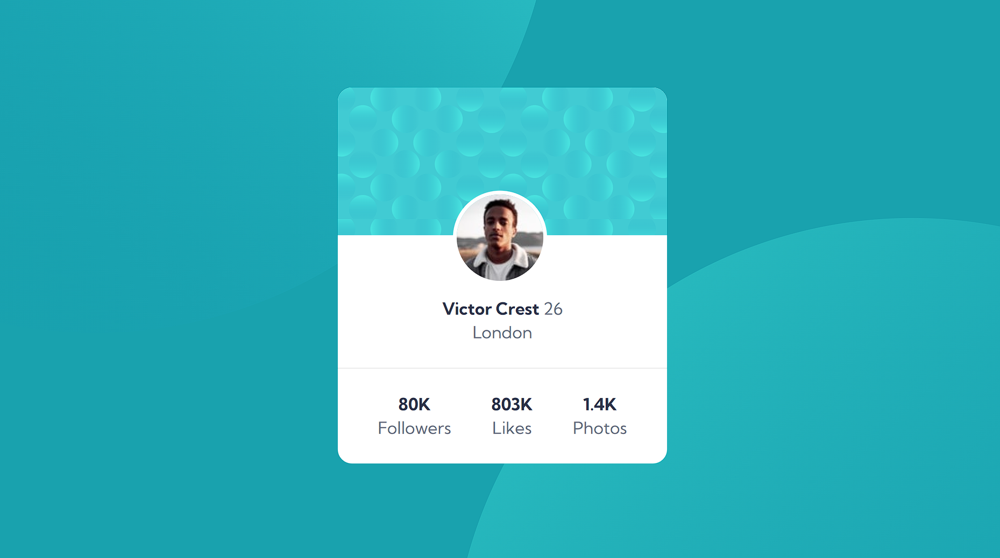
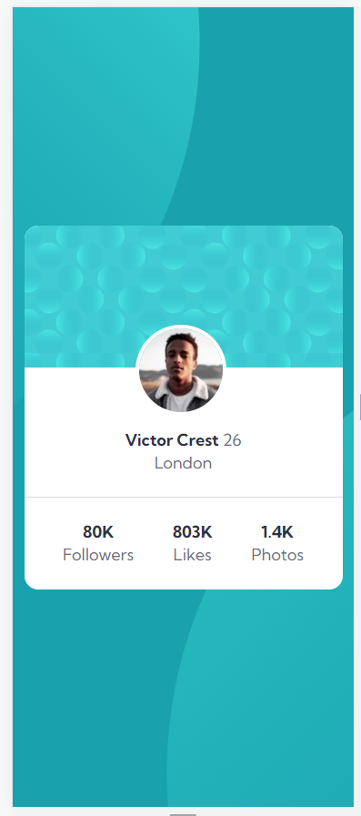

# Frontend Mentor - Profile card component solution

This is a solution to the [Profile card component challenge on Frontend Mentor](https://www.frontendmentor.io/challenges/profile-card-component-cfArpWshJ). Frontend Mentor challenges help you improve your coding skills by building realistic projects.

## Table of contents

- [Overview](#overview)
  - [The challenge](#the-challenge)
  - [Screenshot](#screenshot)
  - [Links](#links)
- [My process](#my-process)
  - [Built with](#built-with)
  - [Continued development](#continued-development)
- [Author](#author)

## Overview

### The challenge

- Build out the project to the designs provided

### Screenshot

### Links

- Solution URL: https://tbendev.github.io/profile-card-component-/

## My process

### Built with

- Semantic HTML5 markup
- CSS custom properties
- Flexbox

### Continued development

- Mobil-First
- BEM
- CSS Flexbox
- CSS Grid
- SASS/SCSS

## Author

- Frontend Mentor - [@tbendev](https://www.frontendmentor.io/profile/tbendev)
- Twitter - [@DevwebTb](https://www.twitter.com/DevwebTb)
